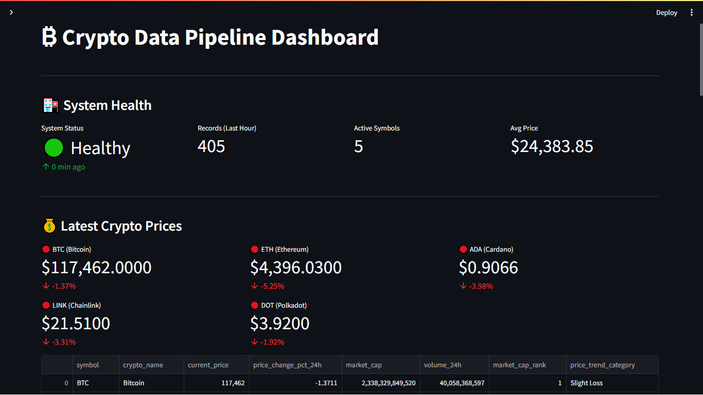
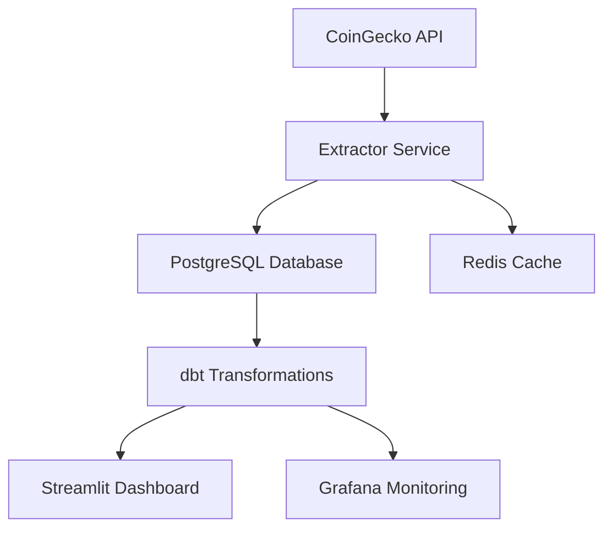

# 🚀 Crypto Data Pipeline

[](https://www.docker.com/)
[](LICENSE)
[](#)

A production-ready, end-to-end data pipeline for cryptocurrency market analytics.

This project takes real-time price data from the CoinGecko API and turns it into clean, trustworthy insights with:

- Automated extraction & loading into PostgreSQL

- Transformations and testing with dbt

- Interactive dashboards in Streamlit

- Advanced monitoring & alerting powered by Grafana

All services are fully containerized with Docker, orchestrated with Make, and wired into CI/CD for production reliability.

Whether you’re exploring crypto market trends, learning modern data engineering, or evaluating production-grade pipeline design, this repo is built to be both a reference and a ready-to-run system.



## 📋 Table of Contents

- [Features](#-features)
- [Architecture](#-architecture)
- [Technology Stack](#-technology-stack)
- [Quick Start](#-quick-start)
- [Installation](#-installation)
- [Usage](#-usage)
- [Configuration](#-configuration)
- [Dashboard](#-dashboard)
- [Monitoring](#-monitoring)
- [Testing](#-testing)
- [Contributing](#-contributing)
- [License](#-license)

## 🌟 Features

- **Real-time Data Extraction**: Pulls cryptocurrency prices from CoinGecko API every hour
- **Data Transformation**: Uses dbt for data modeling and transformation
- **Interactive Dashboard**: Streamlit-based visualization with real-time metrics
- **Advanced Monitoring**: Grafana dashboards for system and data quality monitoring
- **Alert System**: Real-time alerts for data freshness, pipeline failures, and price anomalies
- **Data Quality Assurance**: Automated testing and data validation
- **Containerized Deployment**: Docker and Docker Compose for easy deployment
- **Scalable Architecture**: Designed for high availability and production use

## 🏗️ Architecture



### Architecture Components

1. **Data Extraction Layer**: Asynchronous API calls with retry logic
2. **Data Loading Layer**: PostgreSQL storage with SQLAlchemy ORM
3. **Data Transformation Layer**: dbt models for data cleaning and aggregation
4. **Orchestration Layer**: Scheduled pipeline execution and health monitoring
5. **Visualization Layer**: Streamlit dashboard and Grafana monitoring
6. **Infrastructure**: Docker containerization with Docker Compose

## 🛠️ Technology Stack

- **Core Technologies**: Python, PostgreSQL, dbt, Streamlit, Grafana
- **Libraries**: aiohttp, SQLAlchemy, pandas, plotly, backoff
- **Infrastructure**: Docker, Docker Compose, Make
- **Monitoring**: Grafana, Prometheus-ready metrics

## 🚀 Quick Start

```bash
# Clone the repository
git clone https://github.com/emmanuelrichard01/crypto-data-pipeline.git
cd crypto-data-pipeline

# Build and start services
make build
make up

# Run initial dbt transformations
make dbt-run

# Access services
# Dashboard: http://localhost:8501
# Grafana: http://localhost:3000 (admin/admin123)
```

## 📦 Installation

### Prerequisites

- Docker & Docker Compose
- 8GB RAM minimum
- Available ports: 5432 (PostgreSQL), 8501 (Dashboard), 3000 (Grafana)

### Setup

1. **Clone the repository**:

   ```bash
   git clone https://github.com/emmanuelrichard01/crypto-data-pipeline.git
   cd crypto-data-pipeline
   ```

2. **Configure environment variables**:

   ```bash
   cp .env.example .env
   # Edit .env with your configuration
   ```

3. **Build Docker images**:

   ```bash
   make build
   ```

4. **Start services**:

   ```bash
   make up
   ```

5. **Initialize database**:

   ```bash
   make dbt-run
   ```

## 🎯 Usage

### Starting the Pipeline

```bash
# Start all services
make up

# Run manual data extraction
make run-manual-extraction

# Check pipeline health
make pipeline-health
```

### Stopping Services

```bash
# Stop all services
make down

# Clean up containers and volumes
make clean
```

### Viewing Logs

```bash
# View all logs
make logs

# View specific service logs
make logs-pipeline
make logs-dashboard
```

## ⚙️ Configuration

### Environment Variables

Create a `.env` file in the project root:

```bash
# Database Configuration
DB_HOST=localhost
DB_PORT=5432
DB_NAME=crypto_warehouse
DB_USER=postgres
DB_PASSWORD=crypto_password_123

# CoinGecko API Configuration
COINGECKO_API_KEY=your_api_key_here

# Pipeline Configuration
EXTRACTION_INTERVAL_MINUTES=60
CRYPTOCURRENCIES=bitcoin,ethereum,cardano,polkadot,chainlink
MAX_RETRIES=3
TIMEOUT_SECONDS=30
BATCH_SIZE=100

# Monitoring
LOG_LEVEL=INFO
ENABLE_ALERTS=true
```

### Customizing Cryptocurrencies

Edit `src/config/settings.py` to add or remove cryptocurrencies:

```python
@dataclass
class PipelineConfig:
    cryptocurrencies: List[str] = None

    def __post_init__(self):
        if self.cryptocurrencies is None:
            self.cryptocurrencies = [
                "bitcoin", "ethereum", "cardano",
                "polkadot", "chainlink", "solana",
                "avalanche-2", "polygon"
            ]
```

## 📊 Dashboard

### Main Dashboard Features

1. **System Health**: Real-time pipeline status monitoring
2. **Latest Prices**: Current cryptocurrency prices with 24h changes
3. **Performance Analytics**: Price trends and volatility charts
4. **Pipeline Monitoring**: Success rates and processing metrics

### Navigation

- **Main Page**: Overview and key metrics
- **Data Quality**: Data quality scores and trends
- **Alert System**: Active alerts and notifications

### Key Metrics

- **System Status**: Green = healthy, Red = issues
- **Records/Hour**: Data ingestion rate
- **Success Rate**: Pipeline reliability
- **Data Freshness**: How recent the data is

## 🔍 Monitoring

### Grafana Dashboards

Access Grafana at `http://localhost:3000` (admin/admin123):

1. **Market Overview Dashboard**: Real-time cryptocurrency prices and market metrics
2. **Pipeline Monitoring Dashboard**: ETL pipeline performance metrics
3. **AI Analytics Dashboard**: Prediction accuracy and confidence scores
4. **Sentiment Analysis Dashboard**: Social media and news sentiment tracking
5. **Liquidity Metrics Dashboard**: Order book depth and spread analysis

### Alert System

The system monitors for:

- **Data Freshness**: Alerts when no data has been extracted for over 2 hours
- **Pipeline Failures**: Notifications for failed pipeline runs
- **Price Anomalies**: Alerts for significant price changes (>20% in 24h)

## 🧪 Testing

### Run Unit Tests

```bash
# Run tests in Docker
make test

# Run tests locally
make test-local

# Run tests with coverage
make test-local-cov
```

### Test Structure

- `test_extractor.py`: Tests API data extraction
- `test_loader.py`: Tests database insertion
- `test_orchestrator.py`: Tests full ETL pipeline
- `test_health_monitor.py`: Tests health monitoring functionality
- `test_config.py`: Tests configuration validation

## 🔧 Development

### Setting Up Development Environment

```bash
# Setup Python virtual environment
make setup-dev

# Or on Windows
make setup-dev-windows
```

### Code Quality

```bash
# Run code linting
make lint

# Format code with black
make format

# Run dbt linting
make dbt-lint
```

### Database Migrations

```bash
# Run database migrations
make db-migrate

# Create new migration
make db-migrate-create MESSAGE="migration description"

# Rollback migration
make db-migrate-down
```

## 🌐 Deployment

### Production Deployment

The pipeline is ready for production deployment with:

- **Container Orchestration**: Kubernetes or cloud container services
- **High Availability**: Multi-instance deployments
- **Monitoring Integration**: Prometheus and other monitoring systems

### Cloud Platforms

- ✅ Fly.io
- ✅ Railway.app
- ✅ AWS ECS / Fargate
- ✅ Google Cloud Run
- ✅ Azure Container Apps

## 🔒 Security

### Best Practices

- Use `.env` with `docker-compose` to secure secrets
- Disable public port access to PostgreSQL in production
- Add authentication to Streamlit via reverse proxy or OAuth
- Set up backups and rotation policies for your database

### Environment Security

Never commit sensitive information to version control. Use environment variables for:

- Database credentials
- API keys
- Secret tokens
- Configuration values

## 🤝 Contributing

We welcome contributions! Please follow these steps:

1. Fork the repository
2. Create a feature branch (`git checkout -b feature/amazing-feature`)
3. Commit your changes (`git commit -m 'Add amazing feature'`)
4. Push to the branch (`git push origin feature/amazing-feature`)
5. Open a Pull Request

### Version Control Guidelines

#### Branch Strategy

- `main`: Production-ready code
- `develop`: Integration branch for features
- `feature/*`: New features or enhancements
- `fix/*`: Bug fixes
- `docs/*`: Documentation updates
- `release/*`: Release preparation
- `hotfix/*`: Urgent production fixes

#### Commit Messages

Format: `<type>(<scope>): <description>`

Types:
- `feat`: New feature
- `fix`: Bug fix
- `docs`: Documentation
- `style`: Formatting
- `refactor`: Code restructuring
- `test`: Adding tests
- `chore`: Maintenance

Example:
```
feat(extractor): add support for additional crypto pairs
fix(pipeline): resolve data freshness monitoring issue
docs(readme): update deployment instructions
```

### Protected Paths

The following paths are protected and require review:
- `/src/`
- `/alembic/versions/`
- `/dbt/models/`
- `docker-compose.yml`
- `Dockerfile.*`

### Pull Request Guidelines

#### Required Components
- Clear description of changes
- Related issue references
- Tests for new functionality
- Updated documentation
- Changelog entry

#### Review Process
1. CI checks must pass
2. Code review by at least one maintainer
3. Successful test suite execution
4. Documentation review
5. Changelog verification

#### Quality Standards
- Include unit tests
- Maintain 80%+ test coverage
- Follow [PEP 8](https://peps.python.org/pep-0008/)
- Use type hints
- Add docstrings for functions/classes

## 👨‍💻 Author

Built by [Emmanuel Richard](https://github.com/emmanuelrichard01)

## 📜 License

This project is licensed under the MIT License - see the [LICENSE](LICENSE) file for details.

## 📚 Documentation

- [Architecture Documentation](architecture.md)
- [dbt Documentation](https://docs.getdbt.com/)
- [Streamlit Documentation](https://docs.streamlit.io/)
- [Grafana Documentation](https://grafana.com/docs/)
